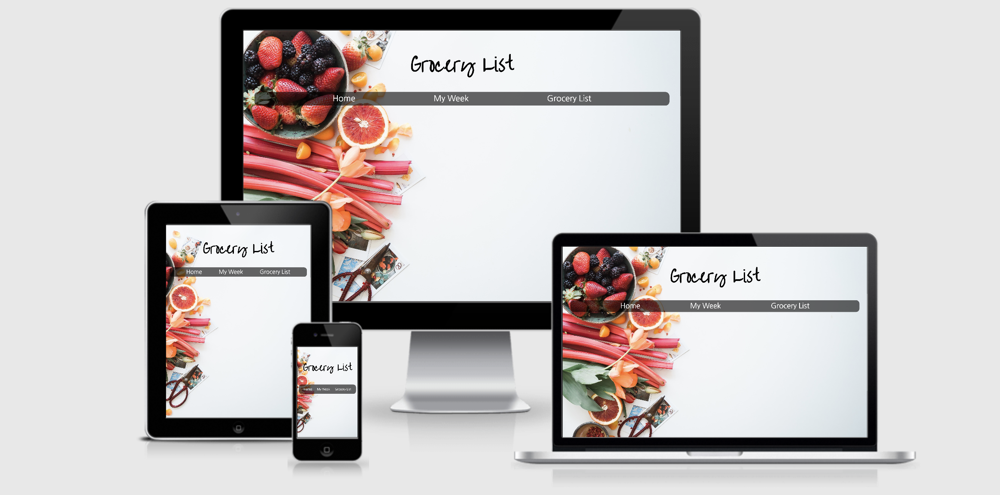

# aid417.github.io

A website that helps you decide what to eat that week

**link**
https://aid417.github.io/Meal-App/index.html

**About:**
Meal App is an app you can use to find new recipes, and plan your meals for the week. Once you decide what you want for the week, you now have a calendar of meals, and an automatically generated grocery list.
**technologies used:**
drag and drop, jquery, javascript, localstorage

**Approach:**
-User input is interpolated into an AJAX call which returns a series of recipes
-User can drop and drop recipes of their choice into divs on the planner
-Once a user drops the recipe into a div, the information is stored in local storage
-User can then click on their grocery list, which is automatically generated based on information in local storage
-if a user removes a recipe from the div, it is cleared from local storage, and it is taken off of the grocery list

**API Used:**
Edamam Recipe Search API
https://developer.edamam.com/edamam-docs-recipe-api

**Issues:**
It was difficult to implement local storage in regards to keeping dynamically generated divs on the page. I ended up having to save each element of the div into local storage in order to regenerate them once the page was loaded
